# Todos API

# Getting Started

## Start the Server

``` bash
rails s
```

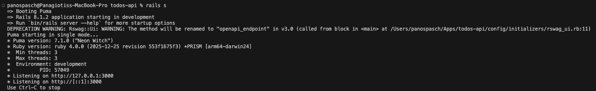

## Base URL

``` bash
BASE=http://localhost:3000
```

------------------------------------------------------------------------

# Authentication

## Signup (παίρνεις token)

``` bash
http POST $BASE/signup   user:='{"email":"me@example.com","password":"Password1!","password_confirmation":"Password1!"}'
```

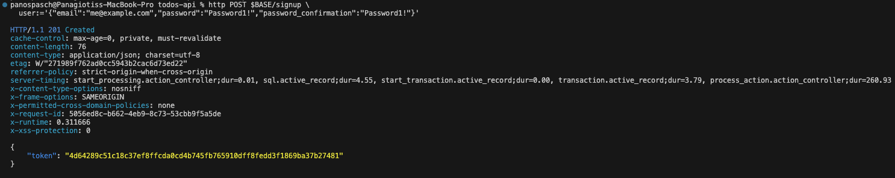

------------------------------------------------------------------------

## Login (παίρνεις token)

``` bash
http POST $BASE/auth/login   user:='{"email":"me@example.com","password":"Password1!"}'
```

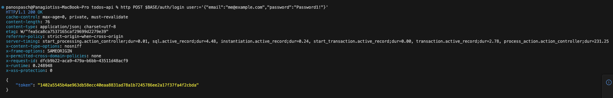

------------------------------------------------------------------------

## Logout (με Bearer token)

``` bash
http GET $BASE/auth/logout   Authorization:"Bearer $TOKEN"
```

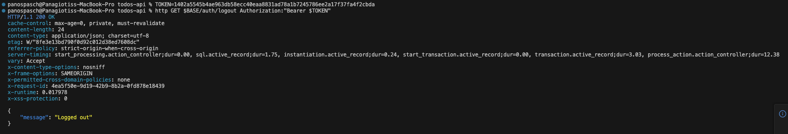

------------------------------------------------------------------------

## Απόδειξη ότι έγινε revoke

(Ξαναχτυπάμε το ίδιο request)

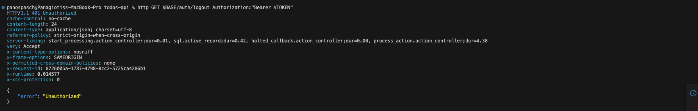

------------------------------------------------------------------------

# Todos Endpoints

## Create Todo

``` bash
http POST $BASE/todos   title="My first todo"   created_by="Panos"
```

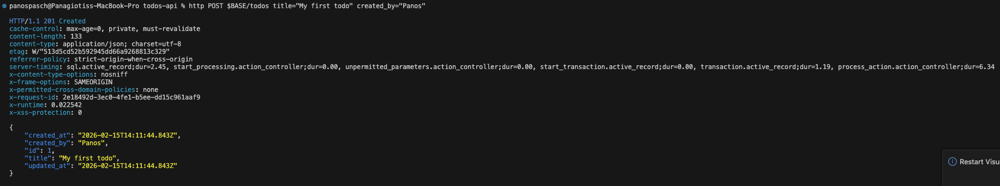

------------------------------------------------------------------------

## List Todos

``` bash
http GET $BASE/todos
```

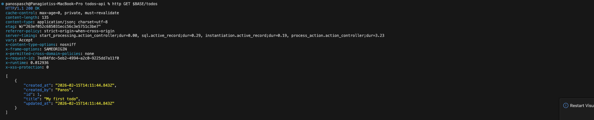

------------------------------------------------------------------------

## Get Todo by ID

``` bash
http GET $BASE/todos/1
```

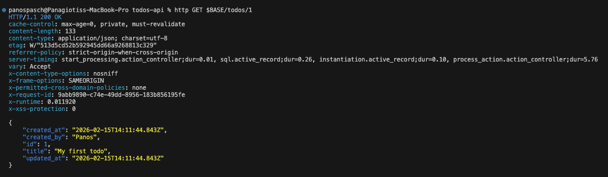

------------------------------------------------------------------------

## Update Todo

``` bash
http PUT $BASE/todos/1   title="Updated title"
```

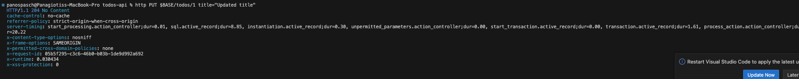

------------------------------------------------------------------------

## Delete Todo

``` bash
http DELETE $BASE/todos/1
```

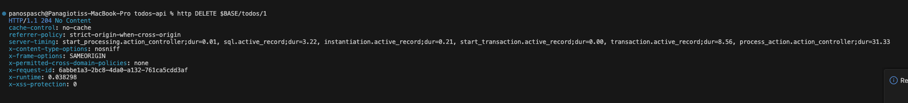

------------------------------------------------------------------------

# Items Endpoints

(Δημιουργούμε ξανά ένα todo γιατί το προηγούμενο το αφαιρέσαμε μόλις)

``` bash
http POST $BASE/todos   title="Todo with items"   created_by="Panos"

TODO_ID=2
```

------------------------------------------------------------------------

## Create Item

``` bash
http POST $BASE/todos/$TODO_ID/items   name="Buy milk"   done:=false
```

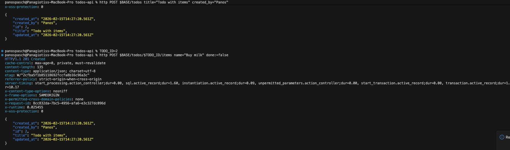

------------------------------------------------------------------------

## Get Item

``` bash
http GET $BASE/todos/$TODO_ID/items/1
```

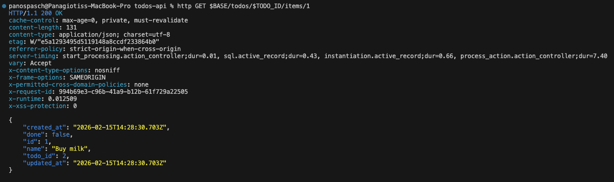

------------------------------------------------------------------------

## Update Item

``` bash
http PUT $BASE/todos/$TODO_ID/items/1   done:=true
```

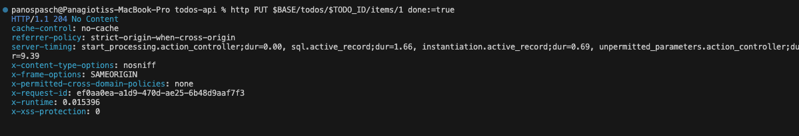

------------------------------------------------------------------------

## Delete Item

``` bash
http DELETE $BASE/todos/$TODO_ID/items/1
```

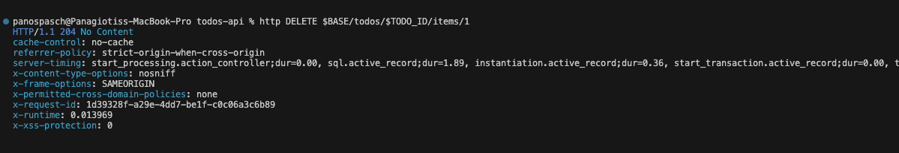

------------------------------------------------------------------------

# Swagger Documentation

Το API περιλαμβάνει πλήρως παραγόμενο αρχείο προδιαγραφής OpenAPI 3.0 μέσω του **rswag**.
Για τη δημιουργία του αρχείου OpenAPI:

``` bash
bundle exec rake rswag:specs:swaggerize
```

Προσβάσιμο μέσω του browser στο:

http://localhost:3000/api-docs

